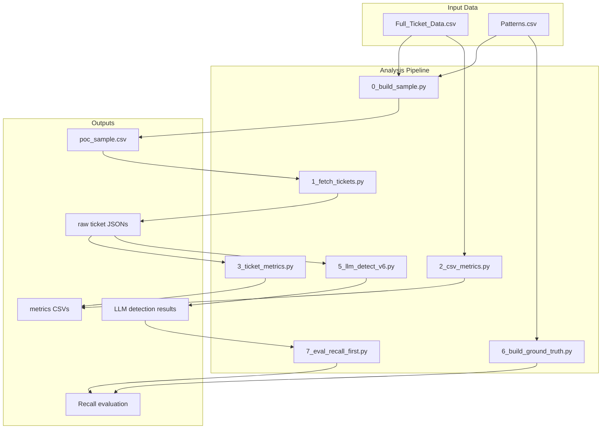

# Kayako Ticket Audit - Central Support Performance Analysis

A comprehensive pipeline for analyzing support ticket quality using deterministic metrics and LLM-based pattern detection. This tool identifies common support quality issues across IgniteTech, Khoros, and GFI verticals.

## Overview

This project analyzes Kayako support tickets to detect patterns indicating potential support quality issues:

| Pattern | Description |
|---------|-------------|
| **AI_QUALITY_FAILURES** | AI (Atlas/Hermes) provides wrong, misleading, filler, or repetitive responses |
| **AI_WALL_LOOPING** | Customer stuck with AI, difficulty reaching human, repetitive AI loop |
| **IGNORING_CONTEXT** | Support ignores info already provided or forces repetition |
| **RESPONSE_DELAYS** | Meaningful response gaps or customer complaints about waiting |
| **PREMATURE_CLOSURE** | Ticket closed while customer still needs help |
| **P1_SEV1_MISHANDLING** | High-severity/outage treated like routine troubleshooting |

## Pipeline Architecture



## Pipeline Scripts

### Phase 0: Data Preparation

| Script | Purpose |
|--------|---------|
| `0_build_sample.py` | Build POC sample of ~100 tickets from seed tickets in Patterns.csv plus random fill |
| `1_fetch_tickets.py` | Fetch ticket_360 data from API for all sample tickets |
| `2_csv_metrics.py` | Extract deterministic metrics from Full_Ticket_Data CSV |
| `3_ticket_metrics.py` | Parse raw ticket JSONs, tag interactions (AI/Employee/Customer), compute timeline metrics |

### Phase 1: LLM Pattern Detection

| Script | Purpose |
|--------|---------|
| `4_llm_detect.py` | Original LLM detection (baseline) |
| `5_llm_detect_v2.py` - `v6.py` | Iterative prompt improvements for better recall |
| `5_llm_detect_v6.py` | **Current best** - Recall-first detection with GPT-5.2 |

### Phase 2: Evaluation

| Script | Purpose |
|--------|---------|
| `6_build_ground_truth.py` | Build filtered ground-truth dataset from Patterns.csv with manual overrides |
| `7_eval_recall_first.py` | Evaluate LLM results against ground truth (recall-first, ignores false positives) |

## Directory Structure

```
├── 0_build_sample.py          # Build POC sample
├── 1_fetch_tickets.py         # Fetch tickets from API
├── 2_csv_metrics.py           # Extract CSV metrics
├── 3_ticket_metrics.py        # Parse ticket interactions
├── 4_llm_detect.py            # LLM detection (v1)
├── 5_llm_detect_v*.py         # LLM detection iterations
├── 6_build_ground_truth.py    # Build ground truth
├── 7_eval_recall_first.py     # Evaluate recall
├── Full_Ticket_Data_*.csv     # Source ticket data (all tickets)
├── IgniteTech_Khoros_GFI...   # Patterns.csv with seed tickets
├── data/
│   └── poc/
│       ├── poc_sample.csv           # Sample ticket list
│       ├── poc_ticket_ids.txt       # Ticket IDs only
│       ├── poc_csv_metrics.csv      # Extracted CSV metrics
│       ├── poc_ticket_metrics.csv   # Interaction metrics
│       ├── ground_truth_expected.csv/.json  # Ground truth labels
│       ├── ground_truth_overrides.json      # Manual corrections
│       ├── raw/                     # Raw ticket_360 JSON files
│       ├── tagged/                  # Tagged interaction files
│       ├── llm_results/             # LLM detection outputs by model
│       │   ├── claude-haiku/
│       │   ├── claude-sonnet/
│       │   ├── gpt-4o/
│       │   ├── gpt-4o-mini/
│       │   ├── gpt-5.2-v*/
│       │   └── ...
│       └── POC_FINDINGS_REPORT.md   # POC analysis report
└── requirements.txt
```

## Setup

### Prerequisites

- Python 3.9+
- OpenAI API key (for LLM detection)

### Installation

1. Clone the repository:
   ```bash
   git clone https://github.com/ignitetech-group/kayako-ticket-audit.git
   cd kayako-ticket-audit
   ```

2. Create a virtual environment:
   ```bash
   python3 -m venv venv
   source venv/bin/activate  # On Windows: venv\Scripts\activate
   ```

3. Install dependencies:
   ```bash
   pip install -r requirements.txt
   ```

4. Configure environment variables:
   ```bash
   cp .env.example .env
   # Edit .env and add your OPENAI_API_KEY
   ```

## Usage

### Full Pipeline Execution

```bash
# Step 1: Build sample from Patterns.csv
python3 0_build_sample.py

# Step 2: Fetch ticket data from API
python3 1_fetch_tickets.py

# Step 3: Extract CSV metrics
python3 2_csv_metrics.py

# Step 4: Extract interaction metrics
python3 3_ticket_metrics.py

# Step 5: Run LLM pattern detection
python3 5_llm_detect_v6.py --ticket-set ground_truth --outdir data/poc/llm_results/gpt-5.2-v6

# Step 6: Build ground truth for evaluation
python3 6_build_ground_truth.py

# Step 7: Evaluate results
python3 7_eval_recall_first.py --results-dir data/poc/llm_results/gpt-5.2-v6
```

### LLM Detection Options

```bash
# Run on all tickets
python3 5_llm_detect_v6.py --ticket-set all

# Run only on ground truth tickets
python3 5_llm_detect_v6.py --ticket-set ground_truth

# Force re-run (overwrite existing results)
python3 5_llm_detect_v6.py --ticket-set ground_truth --force

# Custom output directory
python3 5_llm_detect_v6.py --outdir data/poc/llm_results/my-run
```

### Evaluation

```bash
# Evaluate against ground truth
python3 7_eval_recall_first.py --results-dir data/poc/llm_results/gpt-5.2-v6

# Show more missed labels
python3 7_eval_recall_first.py --results-dir data/poc/llm_results/gpt-5.2-v6 --show-misses 100
```

## POC Findings Summary

From the analysis of 99 tickets:

| Metric | Value |
|--------|-------|
| Tickets with 24h+ response gaps | **45%** |
| Time to first human response (median) | **39 hours** |
| Tickets handed to BU (L2+) | **25%** |
| High priority tickets | **24%** |

### Model Comparison

| Pattern | Claude Sonnet | Claude Haiku | GPT-4o | GPT-4o-mini |
|---------|---------------|--------------|--------|-------------|
| AI Quality Failures | 22.2% | 76.5% | 31.3% | 20.2% |
| AI Wall/Looping | 14.1% | 33.7% | 9.1% | 6.1% |
| Ignoring Context | 22.2% | 24.5% | 19.2% | 36.4% |
| Response Delays | 50.5% | 48.0% | 50.5% | 50.5% |
| Premature Closure | 28.3% | 40.8% | 8.1% | 26.3% |
| P1/SEV1 Mishandling | 29.3% | 19.4% | 12.1% | 23.2% |

See [`data/poc/POC_FINDINGS_REPORT.md`](data/poc/POC_FINDINGS_REPORT.md) for the full analysis.

## Ground Truth Management

The ground truth is built from:
1. **Patterns.csv** - Seed tickets with known issues
2. **ground_truth_overrides.json** - Manual corrections (keep/remove/add labels)

To update ground truth:
```bash
# Edit data/poc/ground_truth_overrides.json as needed
# Then rebuild:
python3 6_build_ground_truth.py
```

## License

Internal use only - IgniteTech Group.

